# Perros unidos

## Objetivos del proyecto
A través de  una investigación, queremos llegar a conocer las necesidades de nuestro cliente y sus usuarios, para cumplir el objetivo del proyecto que es poder potenciar su emprendimiento a través de una plataforma web, que le permita hacer más conocidos sus productos.

## Research
Nuestra investigación se dividió en tres aristas
* [Cliente](https://www.instagram.com/perros.unidos/)

Tuvimos una [entrevista](https://docs.google.com/document/d/1l9KIYfoQymF8P9ONz7eqD4veERcrv0ZNCwBb1GitmKI/edit) con la emprendedora de Perros unidos 
* Usuarios

Realizamos una [encuesta](https://docs.google.com/forms/d/10OSvw_FjCVgf8Pi4jWUUJ0P6ZhbyT3NhHxue7ywTtmA/edit) sobre sus mascotas
* [Industria y contexto](https://docs.google.com/document/d/1-Bc98UTRpXqdVZemGrirEjgguStRbLAHJQC7MdXWW4M/edit)

de los datos que rescatamos:
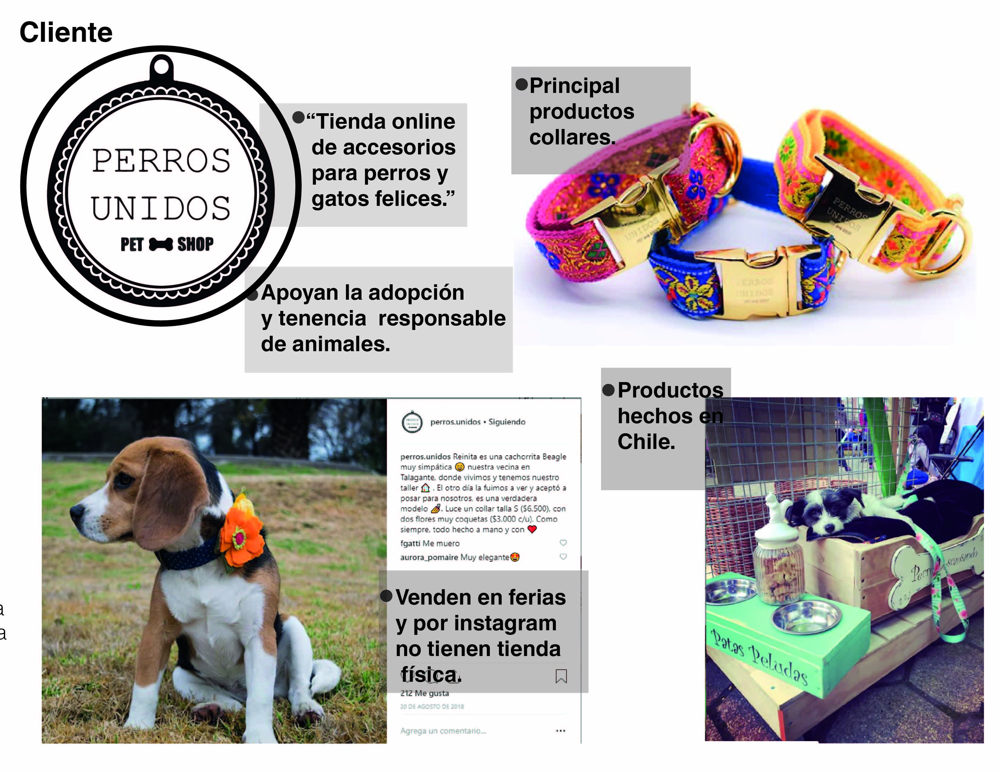

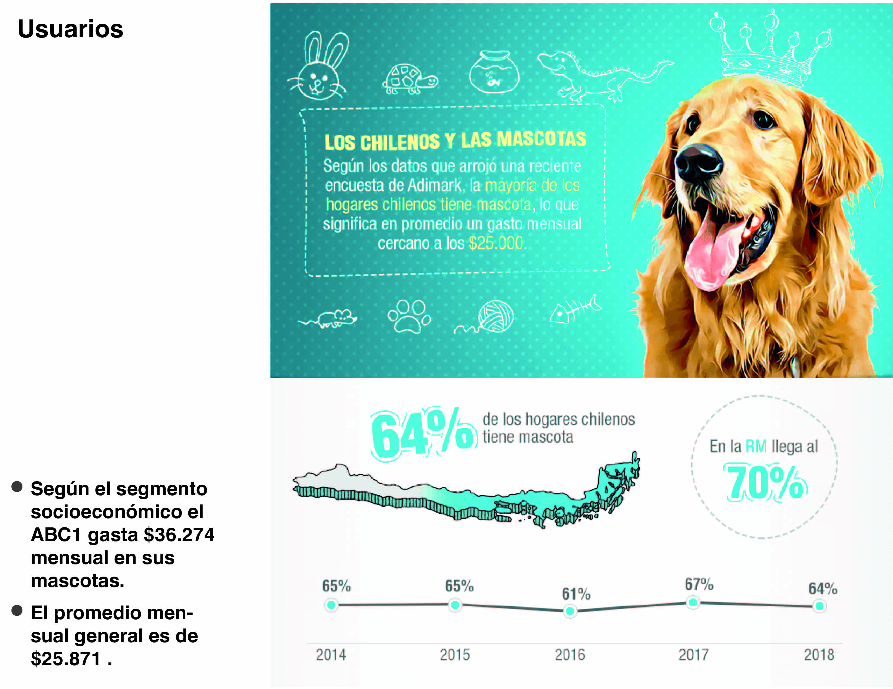
[fuente](https://www.emol.com/noticias/Tendencias/2018/08/30/918804/Mascotas-en-Chile-El-64-de-los-hogares-tiene-al-menos-una-y-la-mayoria-prefiere-perros.html)

## Definición del público objetivo

    * User persona
  

    

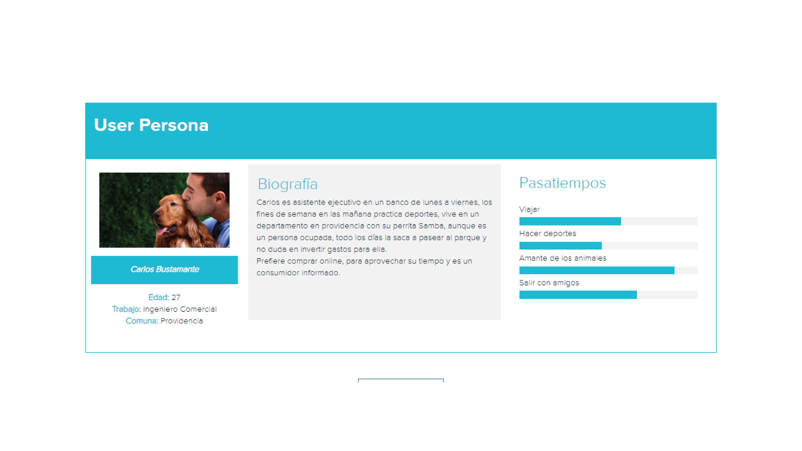
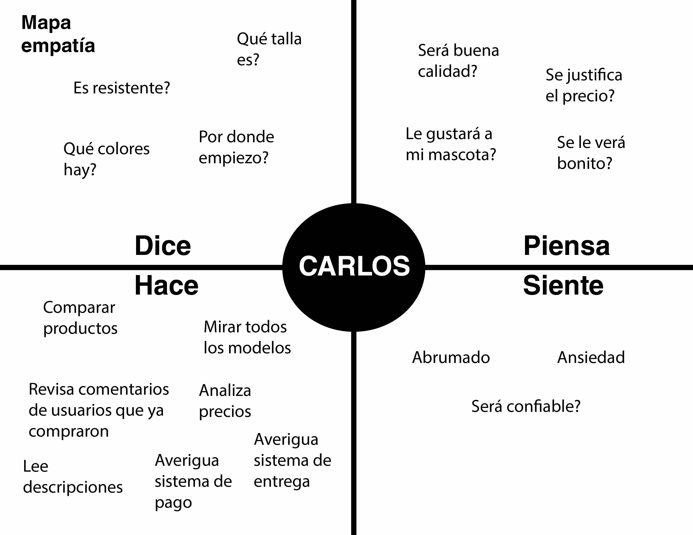

## Problemas identificados en la investigación 

Luego de analizar todo lo aprendido en la investigación
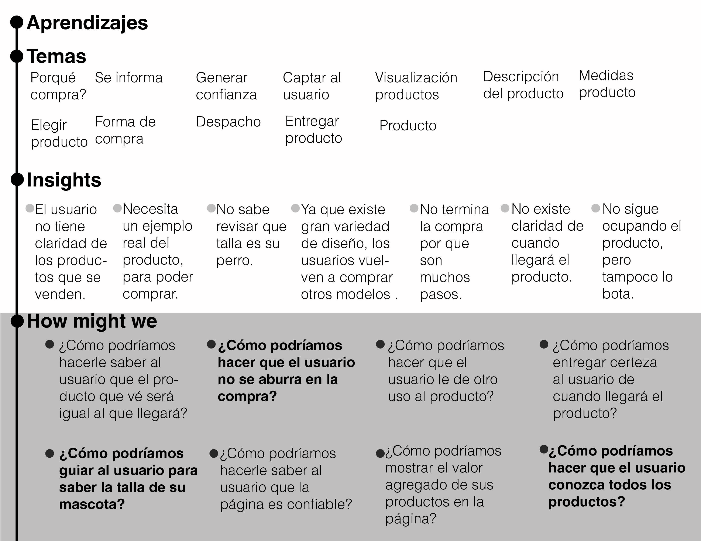
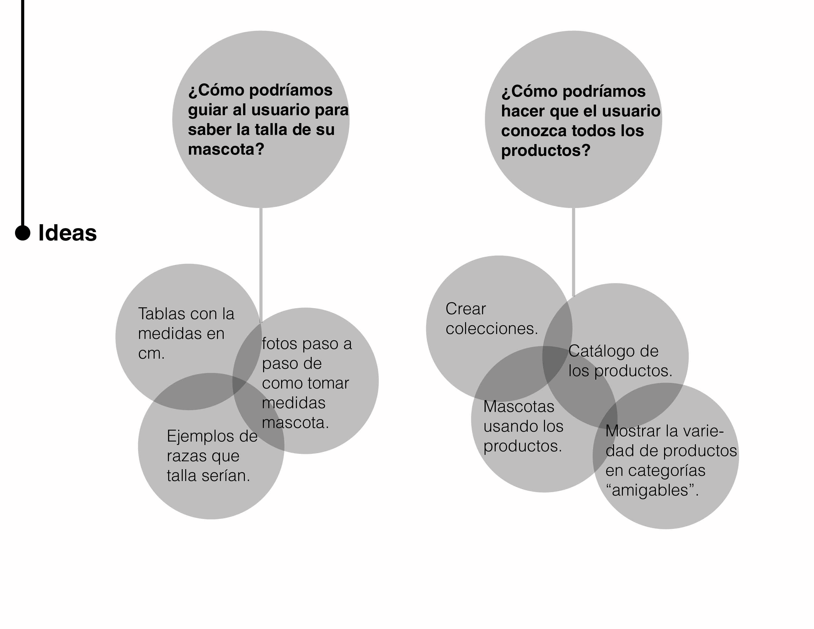

De todo el proceso de ideación, las principales problemáticas que detectamos son:
* el usuario no sabe la talla de su mascota.
* el usuario no tiene conocimiento de todos los productos existentes.

las soluciones que vamos a desarrollar son:
* Entregar una guía de tallas al usuario a través de imágenes y tablas de las medidas en cm.
* Mostrar un catálogo digital de todos los productos que ofrece el cliente, con filtros de los productos.

A futuro se seguiran resolviendo las otras problemáticas detectadas.

## Desarrollo del prototipo

* Referentes

Analizamos diversas páginas relacionadas al tema y de su compentencia directa, [acá](https://docs.google.com/document/d/1K8djP5KGIn57tbPWc4IXUEcObzf4uDhE2MunZ81poEE/edit)

 se puede ver en detalle las páginas, y abajo las cosas que más nos llamaron la atención.
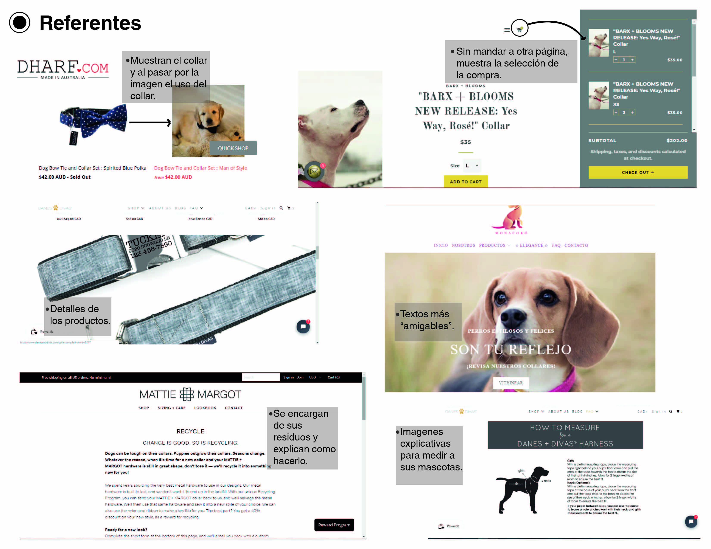

* Card sorting

Una vez analizado varios referentes para ver los contenido de la página y hablado con nuestra emprendedora, seleccionamos algunas categorías y subcategorías y se las mostramos a 5 usuarios a través del card sorting,
acá se puede ver en los [videos y fotos](https://drive.google.com/drive/u/0/folders/1XDDMetx8t1Ja29uVGXaZSy9WGJJr1ViP) y algunas observaciones, para definirlas y comenzar los bocetos.

* Sketch

Luego de analizar referentes y realizar el card sorting, comenzamos a hacer scketchs de la estructura de la página.

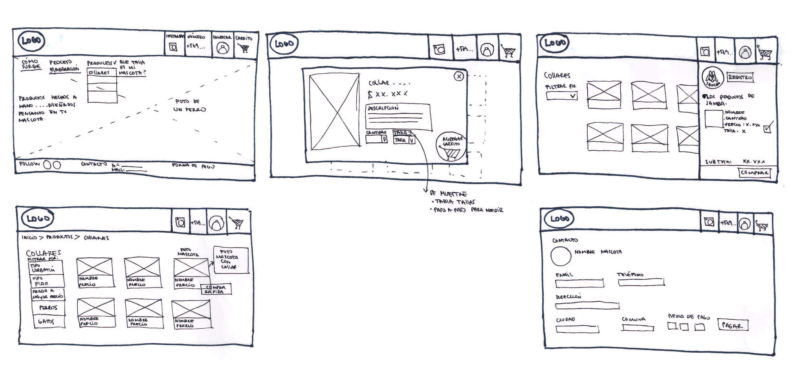

* Testeo 

Cuando llegamos a uno más definido lo testeamos con 5 usuarios,
acá estan los [Videos](https://drive.google.com/drive/u/0/folders/1Wj1f1ZyNJoihclXolRVMGYhMrteCTrCJ)  y algunas observaciones que nos realizaron.
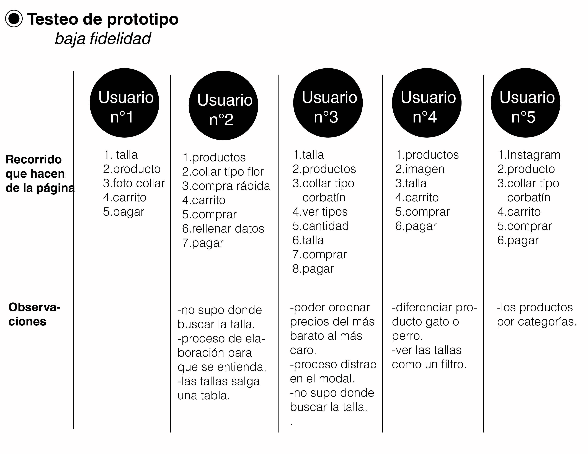
Realizamos correcciones e hicimos el Wireframing y pasamos a desarrollar el prototipo de alta fidelidad en figma.

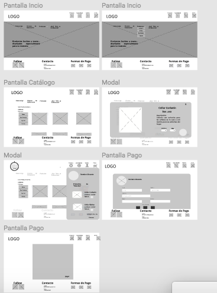

* Testeo de usabilidad

Una vez desarrollado el prototipo de alta fidelidad, lo testeamos con 5 usuarios, aca se puede ver en los [Videos](https://drive.google.com/drive/u/0/folders/1b5aqp9a6uTnBkdbD_NUP1EBLMVNyeISm), de acuerdo a sus observaciones hicimos las ultimas correcciones.

## Link a prototipo navegable
[Figma](https://www.figma.com/file/58mDmnRkGyW0nqQweI5bkR/Perros.Unidos-Modificado?node-id=0%3A1)

## Link de Zeplin
[Zeplin](https://app.zeplin.io/project/5c5c22707eb09205265c28f8)

## Contenidos

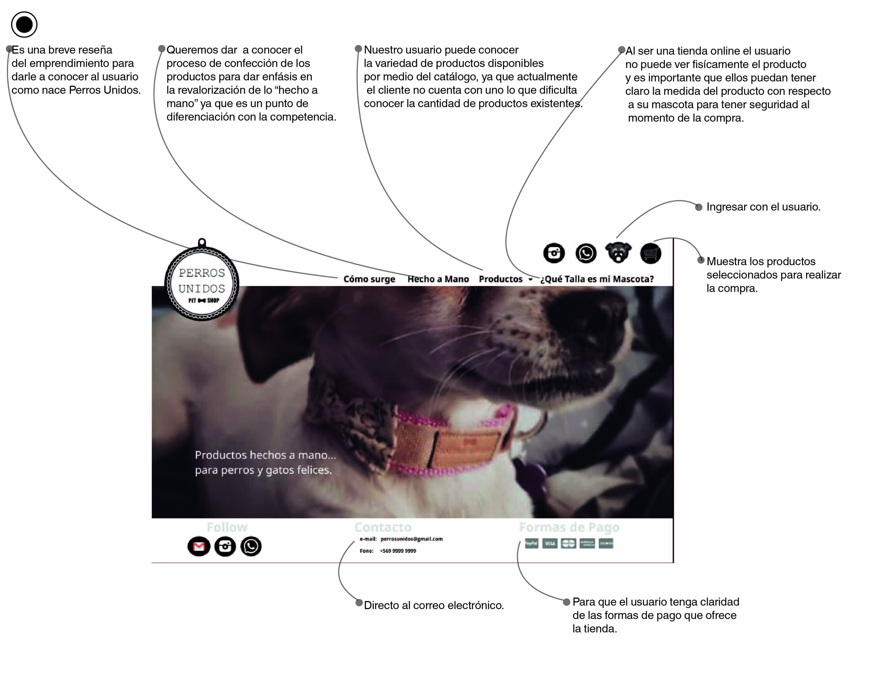
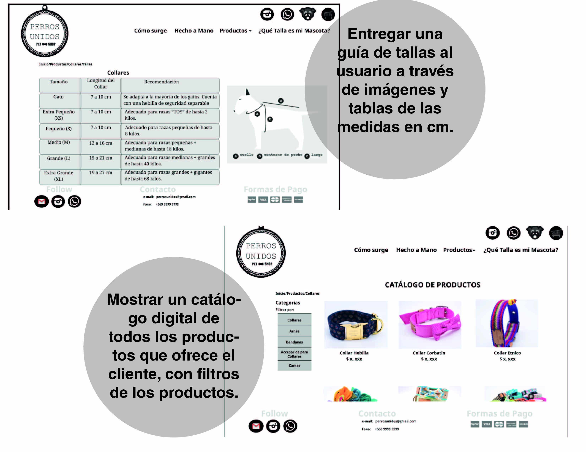
Propuestas de soluciones a las problemáticas detectadas.

video en [Loom](https://drive.google.com/drive/u/0/folders/1azJ46jwKgsfbykZ15mGlhzFeapfNOZCb
)

[Planificación](https://github.com/paumgr/scl-2018-02-ux-marketplace/projects/1
)

